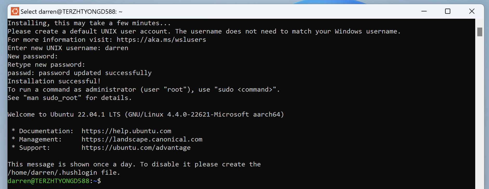
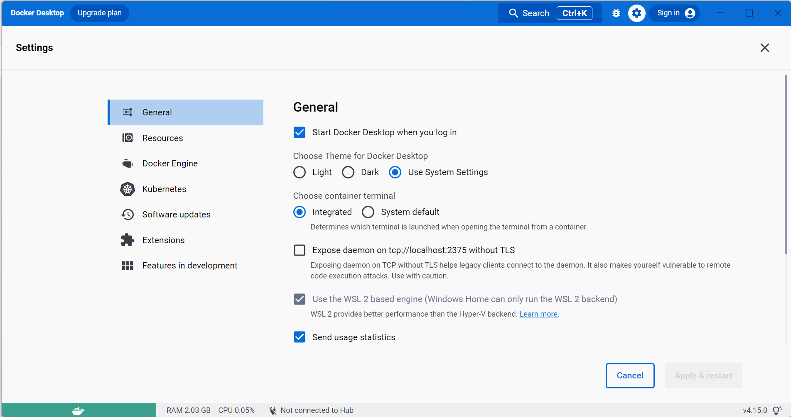
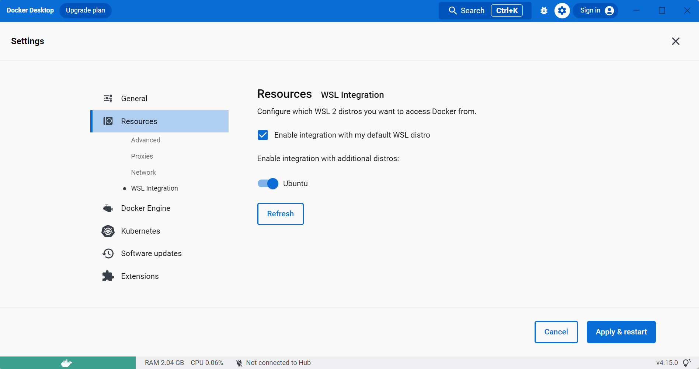
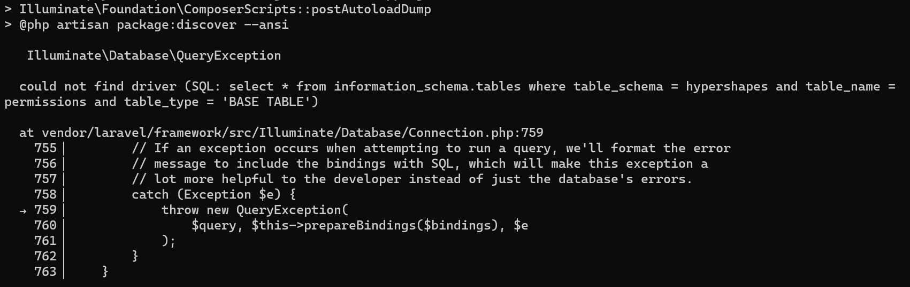
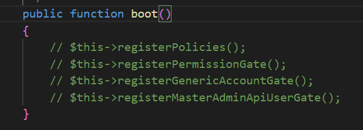
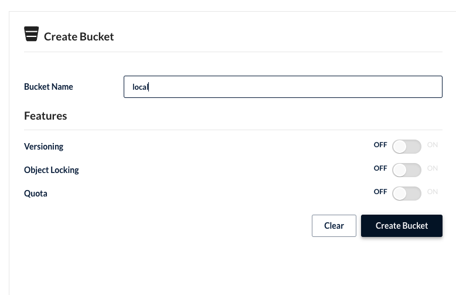
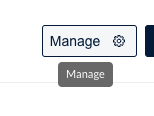
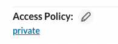

# Table of Contents:
- [Installation Guide](#installation-guide)
- [Daily Development](#daily-development)

# Installation Guide

## Prerequisites:
### WSL 2 (Windows only)
1. Open `Command Prompt` and run it as **administrator**
1. Run `wsl --install` to enable Windows Subsystem for Linux and install Ubuntu distro
   - The above command only works if WSL is not installed at all, if you run `wsl --install` and see the WSL help text, please install Ubuntu by running: 
      ```
      wsl --set-default-version 2
      wsl --install -d Ubuntu-22.04
      ```
    - Once Ubuntu has been installed and finished its initial setup, you will need to create a username and password (this does not need to match your Windows user credentials) 
1. Once the command has succeeded without error, **restart your laptop**
1. Open `Command Prompt` again and run `wsl -l -v`, make sure Ubuntu distro is running in version 2

### Windows Terminal (Windows only)
- Get and Install the Windows Terminal from your [Microsoft Store](https://apps.microsoft.com/store/detail/windows-terminal/9N0DX20HK701?hl=en-my&gl=my)
- Launch it once successfully installed

### Docker Desktop
1. Download Docker Desktop according to your laptop's operating system
   - Windows: https://docs.docker.com/desktop/windows/install/
   - MacOS: https://docs.docker.com/desktop/mac/install/
1. Install the downloaded package and follow the installation wizard
1. Once docker is successfully installed, restart your laptop
1. Now open again Docker Desktop, open up **Settings** (gear icon at the top right of Docker Desktop) and make sure:
   - Under **General**, "Use the WSL 2 based engine" is enabled
     
     
   - Under **Resources** > **WSL Integration**, "Ubuntu" is enabled

     
   - Click on **Apply & restart** button whenever you made any changes in Settings

## To setup project
1. Open up Windows Terminal, enter Ubuntu distro by running `wsl` 
1. Clone this project by running:
   ```
   cd ~
   git clone https://gitlab.com/hypershapes/hypershapes.git
   ```
1. run `cd hypershapes` to get into project
1. create environment file by running:
   ```
   cp .env.example
   ```
1. Install application dependencies through this command:
   ```
   docker run --rm \
    -u "$(id -u):$(id -g)" \
    -v "$(pwd):/var/www/html" \
    -w /var/www/html \
    laravelsail/php81-composer:latest \
    composer install --ignore-platform-reqs
   ```
   - if you face error on migration, run `code .` to open this project in VS Code, then press `CTRL + P` to find `AuthServiceProvider.php` and disable 4 lines under `boot()` function. Then run the command above again
    
     

     
1. Now, add alias for `sail` command:
    ```
    alias sail='[ -f sail ] && sh sail || sh vendor/bin/sail'
    ```
1. Before start containers, remove `:80` from the runtime file in vendor, otherwise `sail up -d` will run forever
   1. In your project folder go to `/vendor/laravel/sail/runtimes/8.1`
   1. On `line:21`, remove `:80` so the line should be this: 
    ```
    && echo "keyserver hkp://keyserver.ubuntu.com" >> ~/.gnupg/dirmngr.conf \
    ```
1. Start all the containers by running:
   ```
   sail up -d
   ```
   - this command will take long time to complete, as it will download the images of all containers from docker hub
1. Complete the project setup by running these commands sequentially
   ```
    sail artisan key:generate
    sail artisan migrate:fresh --seed
    sail npm install
    sail npm run dev
   ```
1. Now visit:
   - http://localhost for application
   - http://localhost:8025 for mailhog (web UI for email testing)
   - http://localhost:8080 for phpmyadmin (database visualisation tool)
   - http://localhost:8900 for minio (dashbaord for S3 compatible object storage)

## Minio Setup
1. Vist http://localhost:8900 on your browser
1. Login to the minio with:
   - username: sail
   - password: password
1. Click on **Create Bucket +** button
1. On the Create Bucket page, fill in `local` as Bucket Name

   
1. Click on **Create Bucket** button
1. Now the bucket is created. Click on **<- Buckets** button on header to back to bucket list

   
1. Click on Manage button of the `local` bucket you created just now

   
1. Click on the `private` under **Access Policy**

   
1. On the modal, change the Access Policy from **Private** to **Public**
1. Click on **Set** button
1. Now try to upload an image in Hypershapes system, you should able to see your uploaded image in this `local` bucket

# Daily Development
1. Open up Windows Terminal and run
   ```
   wsl 
   cd ~/hypershapes
   ```
1. Open the project in VS Code by running `code .`
1. Launch a terminal in VS Code, run 
   ```
   sail up -d
   sail npm run dev
   ```
1. Open up http://localhost in your browser and start development
1. Whenever you want to stop the development, run
   ```
   sail down
   ```

## Commands
### `npm`/`composer`/`php`/`node`
- you need to prepend `sail` in front of every `npm`/`composer`/`php`/`node` commands.

   Exp:
   ```
   sail composer install
   sail npm i vite
   sail node -v
   ```
### `php artisan`
- instead of `php artisan xxx`, run `sail artisan xxx`

  Exp:
  ```
  sail artisan migrate
  sail artisan queue:restart
  ```

