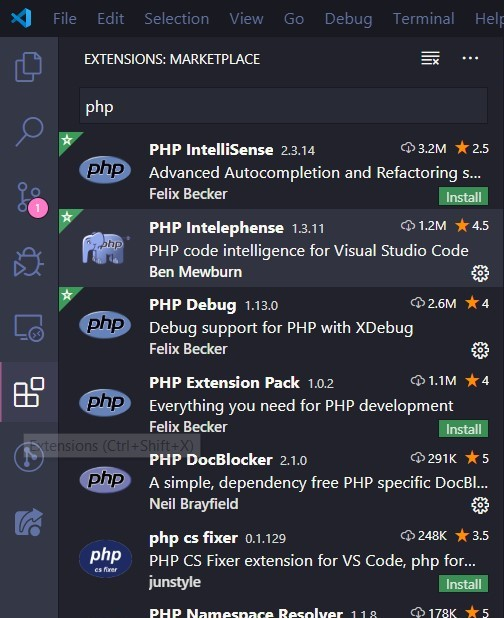
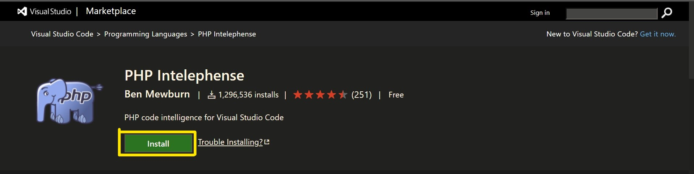

## Main VS Code extensions Used for this project

One of the primary attraction of VS Code is its extensions. If you just get started with VS Code, there are some extensions you can install to improve your development experience.

### How to install
The easiest way to install VS Code extensions is go to its extensions page, then search for the name of the extension to install.



The other way is click the link below, it will direct you to visual studio marketplace. Just click the install button, then follow the instruction to install them.



### Extensions
Here are some extensions that I would like to recommend you to install. There are **important** and **optional** extensions, which important extensions are strongly recommended and compulsory to install, whereas optional extensions are entirely depends on you whether install or not.

#### Important
1. [PHP Intelephense](https://marketplace.visualstudio.com/items?itemName=bmewburn.vscode-intelephense-client)

PHP Intelephense is one of the best extensions can be found out there in VS Code. Latest version of PHP Intelephense comes with several problems with Laravel project, like false positive `undefined method` errors. To fix them, add this in your `settings.json`:

```json
{
    "intelephense.diagnostics.undefinedMethods": false,
    "intelephense.diagnostics.undefinedTypes": false,
}
```

2. [Laravel Extension Pack](https://marketplace.visualstudio.com/items?itemName=onecentlin.laravel-extension-pack)

Laravel Extension Pack written by Winnie Lim is a collection of extensions for Laravel development. It includes several extensions which are useful for Laravel development in VS Code such as Laravel Blade Snippets, Laravel goto view and so on.

#### Optional
3. [GitLens](https://marketplace.visualstudio.com/items?itemName=eamodio.gitlens)

GitLens is a useful extension to visualise code authorship at a glance via Git blame annotations and code lens, seamlessly navigate and explore Git repositories, gain valuable insights via powerful comparison commands, and so much more. For more info please refer to its docs.

4. [Git History](https://marketplace.visualstudio.com/items?itemName=donjayamanne.githistory)

Git history extension let you view git log, file history, compare branches or commits. One of the features of Git History that I personally use the most is view previous copy of the file. Sometimes this is useful if you want to see what have you or others changed in this file.

5. [Path Intellisense](https://marketplace.visualstudio.com/items?itemName=christian-kohler.path-intellisense)

Simple description that speaks everything; Path intellisense is a Visual Studio Code plugin that autocompletes filenames

6. [Code Spell Checker](https://marketplace.visualstudio.com/items?itemName=streetsidesoftware.code-spell-checker)

Spelling checker for source code. Stop making mistakes and bugs due to typo!

7. [Auto Close Tag](https://marketplace.visualstudio.com/items?itemName=formulahendry.auto-close-tag)

Automatically add HTML/XML close tag, same as Visual Studio IDE or Sublime Text. 

#### Optional (Color Themes)
8. [Dracula Official](https://marketplace.visualstudio.com/items?itemName=dracula-theme.theme-dracula)

Official Dracula Theme. A dark theme for many editors, shells, and more.

9. [Shades of Purple](https://marketplace.visualstudio.com/items?itemName=ahmadawais.shades-of-purple)

A professional theme with hand-picked & bold shades of purple for your VS Code editor and terminal. One of the excellent most downloaded and top rated VSCode Themes on the marketplace.

10. [Winter is Coming Theme](https://marketplace.visualstudio.com/items?itemName=johnpapa.winteriscoming)

This extension for Visual Studio Code adds themes titled "Winter is Coming". There are dark, dark with no italics, and light themes. Created by John Papa
